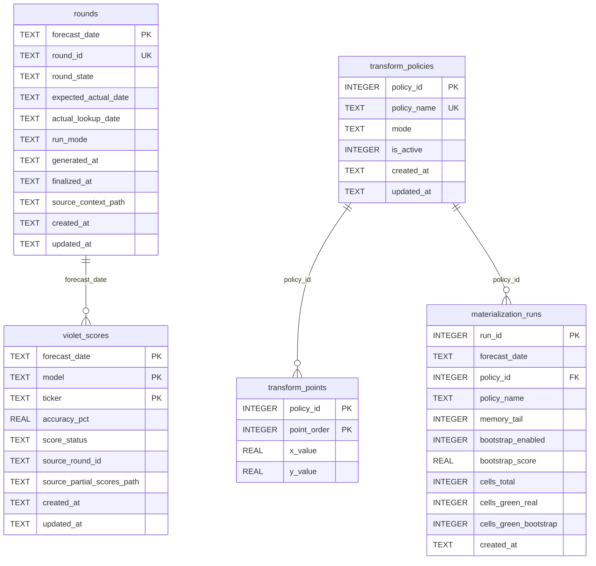
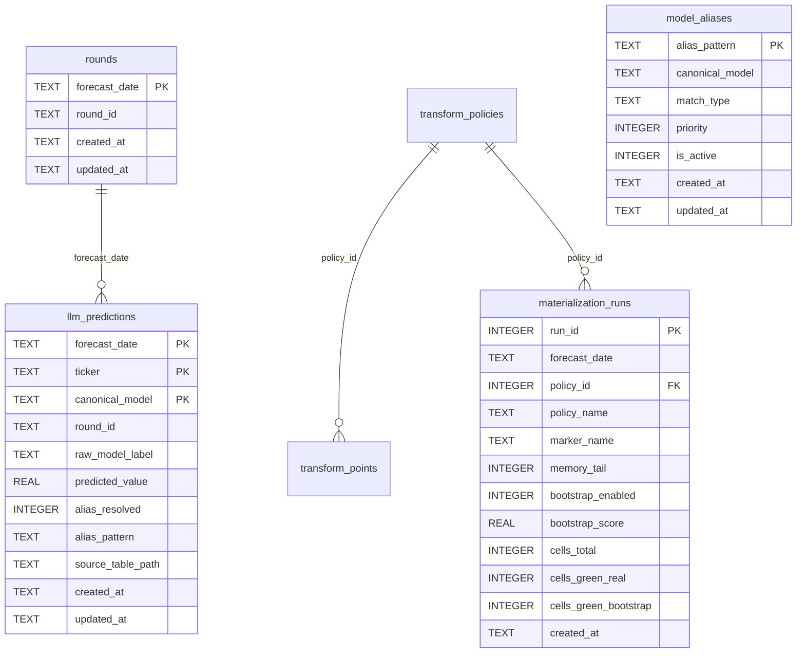
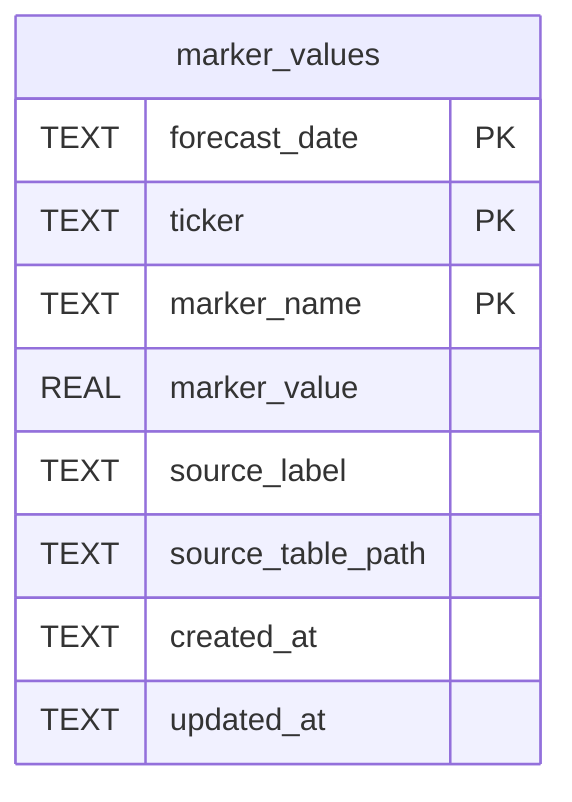
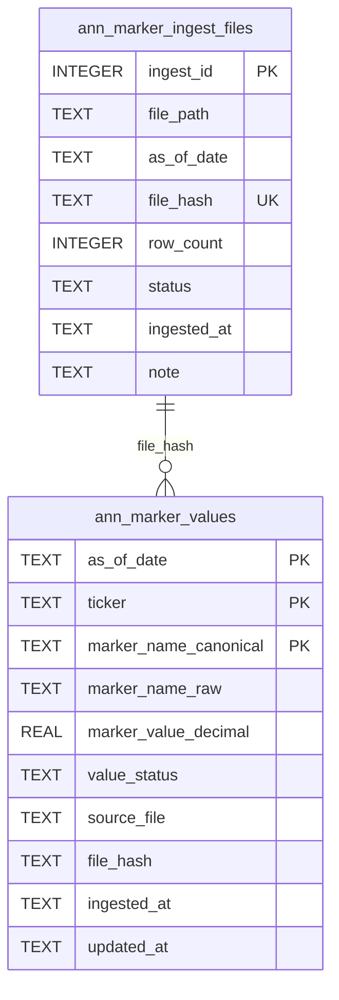

# SQL and JSON Data Schema

This document specifies current FIN sqlite and JSON contracts used by forecasting, follow-up, and worker integrations.

## SQL Schemas

## 1) ML VG Store (`out/i_calc/ML/ML_VG_tables.sqlite`)

Defined in `src/followup_ml/vg_store.py`.

Main tables:
- `schema_meta(meta_key PK, meta_value, updated_at)`
- `rounds(forecast_date PK, round_id UNIQUE, round_state, expected_actual_date, actual_lookup_date, run_mode, generated_at, finalized_at, source_context_path, created_at, updated_at)`
- `violet_scores((forecast_date, model, ticker) PK, accuracy_pct, score_status, source_round_id, source_partial_scores_path, created_at, updated_at)`
- `transform_policies(policy_id PK, policy_name UNIQUE, mode, is_active, created_at, updated_at)`
- `transform_points((policy_id, point_order) PK, x_value, y_value)`
- `materialization_runs(run_id PK, forecast_date, policy_id, policy_name, memory_tail, bootstrap_enabled, bootstrap_score, cells_total, cells_green_real, cells_green_bootstrap, created_at)`



## 2) LLM VG Store (`out/i_calc/LLM/LLM_VG_tables.sqlite`)

Defined in `src/followup_ml/llm_vg_store.py` (`initialize_llm_vg_db`).

Main tables:
- `schema_meta`
- `rounds(forecast_date PK, round_id nullable unique-indexed when present, created_at, updated_at)`
- `model_aliases(alias_pattern PK, canonical_model, match_type, priority, is_active, created_at, updated_at)`
- `llm_predictions((forecast_date, ticker, canonical_model) PK, round_id, raw_model_label, predicted_value, alias_resolved, alias_pattern, source_table_path, created_at, updated_at)`
- `transform_policies`, `transform_points`, `materialization_runs` (same policy pattern as ML VG, with `marker_name` column)



## 3) Markers Store (`out/i_calc/Markers.sqlite`)

Defined in `src/followup_ml/llm_vg_store.py` (`initialize_markers_db`).

Main tables:
- `schema_meta`
- `marker_values((forecast_date, ticker, marker_name) PK, marker_value, source_label, source_table_path, created_at, updated_at)`



## 4) ANN Marker Ingest Store (`out/i_calc/stores/ann_markers_store.sqlite`)

Defined in `scripts/ann_markers_ingest.py` (`ensure_schema`).

Main tables:
- `ann_marker_ingest_files(ingest_id PK, file_path, as_of_date, file_hash UNIQUE, row_count, status, ingested_at, note, UNIQUE(file_path, as_of_date))`
- `ann_marker_values((as_of_date, ticker, marker_name_canonical) PK, marker_name_raw, marker_value_decimal, value_status, source_file, file_hash, ingested_at, updated_at)`
- `schema_meta`



## 5) ANN Input Feature Store (`out/i_calc/stores/ann_input_features.sqlite`)

Defined in `src/ui/services/ann_feature_store.py` and populated by `scripts/ann_feature_stores_ingest.py`.

Main tables:
- `ann_ti_inputs((as_of_date, ticker, feature_name) PK, feature_value, value_status, source_file, source_batch, loaded_at, updated_at)`
- `ann_pivot_inputs((as_of_date, ticker, feature_name) PK, feature_value, value_status, source_file, source_batch, loaded_at, updated_at)`
- `ann_hurst_inputs((as_of_date, ticker, feature_name) PK, feature_value, value_status, source_file, source_batch, loaded_at, updated_at)`
- `ann_tda_h1_inputs((as_of_date, ticker, feature_name) PK, feature_value, value_status, source_file, source_batch, loaded_at, updated_at)`
- `ann_feature_ingest_files(ingest_id PK, file_path, source_family, source_batch, rows_written, status, ingested_at, note, UNIQUE(file_path, source_family, source_batch))`
- `schema_meta`

Source lineage:
- TI inputs from `out/i_calc/TI/*.csv` (classical indicators)
- Pivot inputs from `out/i_calc/PP/*.csv` (classic/fibonacci/camarilla/woodie/demark levels)
- Hurst inputs from `out/i_calc/svl/SVL_METRICS_*.csv` (`H20/H60/H120`)
- TDA CPI inputs from `out/i_calc/tda/TDA_METRICS_*.csv` (`H1_MaxPersistence`, `H1_CountAbove_Thr`, `H1_Entropy`)

## JSON Schemas

## 1) DynaMix Worker Protocol Payload

Source: `scripts/workers/dynamix_worker.py`.

```json
{
  "$schema": "https://json-schema.org/draft/2020-12/schema",
  "$id": "fin/dynamix-worker-protocol.schema.json",
  "type": "object",
  "required": ["protocol_version", "ok", "artifact_csv", "meta", "error"],
  "additionalProperties": false,
  "properties": {
    "protocol_version": {"type": "string"},
    "ok": {"type": "boolean"},
    "artifact_csv": {"type": ["string", "null"]},
    "meta": {
      "type": "object",
      "required": ["ticker", "device"],
      "properties": {
        "ticker": {"type": "string"},
        "device": {"type": "string", "enum": ["cpu"]},
        "rows": {"type": "integer"},
        "columns": {"type": "array", "items": {"type": "string"}},
        "model_name": {"type": "string"},
        "target_col": {"type": "string"}
      }
    },
    "error": {
      "type": ["object", "null"],
      "required": ["type", "message"],
      "properties": {
        "type": {"type": "string"},
        "message": {"type": "string"}
      }
    }
  }
}
```

## 2) PCE Worker In/Out JSON

Source: `scripts/workers/pce_worker.py`.

Input schema:

```json
{
  "$schema": "https://json-schema.org/draft/2020-12/schema",
  "$id": "fin/pce-worker-input.schema.json",
  "type": "object",
  "required": ["enriched_data_csv", "forecast_csv_out"],
  "additionalProperties": false,
  "properties": {
    "enriched_data_csv": {"type": "string"},
    "exog_train_csv": {"type": ["string", "null"]},
    "exog_future_csv": {"type": ["string", "null"]},
    "ticker": {"type": "string"},
    "target_col": {"type": ["string", "null"]},
    "fh": {"type": ["integer", "null"], "minimum": 1},
    "forecast_csv_out": {"type": "string"}
  }
}
```

Output schema:

```json
{
  "$schema": "https://json-schema.org/draft/2020-12/schema",
  "$id": "fin/pce-worker-output.schema.json",
  "type": "object",
  "required": ["status", "model", "time_utc", "ticker", "forecast_csv", "error", "traceback", "meta"],
  "additionalProperties": false,
  "properties": {
    "status": {"type": "string", "enum": ["OK", "INSUFFICIENT_DATA", "ERROR"]},
    "model": {"type": "string", "const": "PCE_NARX"},
    "time_utc": {"type": "string"},
    "ticker": {"type": "string"},
    "forecast_csv": {"type": ["string", "null"]},
    "error": {"type": ["string", "null"]},
    "traceback": {"type": ["string", "null"]},
    "meta": {"type": "object"}
  }
}
```

## 3) Follow-up Round Context JSON

Source artifact: `out/i_calc/followup_ml/rounds/<round_id>/round_context.json`.

```json
{
  "$schema": "https://json-schema.org/draft/2020-12/schema",
  "$id": "fin/followup-round-context.schema.json",
  "type": "object",
  "required": ["schema_version", "round_id", "round_state", "generated_at", "fh", "tickers", "models", "outputs"],
  "properties": {
    "schema_version": {"type": "string"},
    "round_id": {"type": "string"},
    "round_state": {"type": "string"},
    "generated_at": {"type": "string"},
    "finalized_at": {"type": "string"},
    "fh": {"type": "integer", "minimum": 1},
    "tickers": {"type": "array", "items": {"type": "string"}},
    "models": {"type": "array", "items": {"type": "string"}},
    "exo_config_path": {"type": "string"},
    "scoring_config": {"type": "object"},
    "weights_applied": {"type": "object"},
    "outputs": {"type": "object"},
    "actuals": {"type": "object"},
    "scores": {"type": "object"},
    "avr": {"type": "object"},
    "weights": {"type": "object"}
  }
}
```

## 4) Follow-up Parity Manifest JSON

Source artifact: `tests/fixtures/followup_ml/parity/manifest.json`.

```json
{
  "$schema": "https://json-schema.org/draft/2020-12/schema",
  "$id": "fin/followup-parity-manifest.schema.json",
  "type": "object",
  "required": ["schema", "updated_at", "rounds"],
  "properties": {
    "schema": {"type": "string", "const": "followup-ml-parity-v1"},
    "updated_at": {"type": "string"},
    "rounds": {
      "type": "object",
      "additionalProperties": {
        "type": "object",
        "required": ["state", "captured_at", "fixture_dir", "files", "missing_optional"],
        "properties": {
          "state": {"type": "string"},
          "captured_at": {"type": "string"},
          "fixture_dir": {"type": "string"},
          "files": {"type": "array", "items": {"type": "string"}},
          "missing_optional": {"type": "array", "items": {"type": "string"}}
        }
      }
    }
  }
}
```

## Schema Versioning Notes

- SQLite stores expose schema version in `schema_meta`.
- Follow-up JSON includes explicit `schema_version` and parity manifest includes `schema`.
- Worker payloads should be treated as protocol contracts; backward compatibility should be additive where possible.
