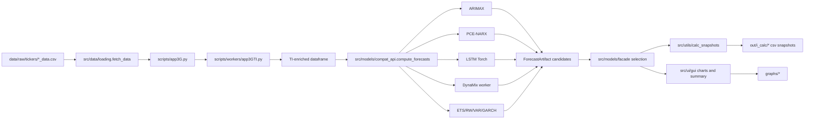
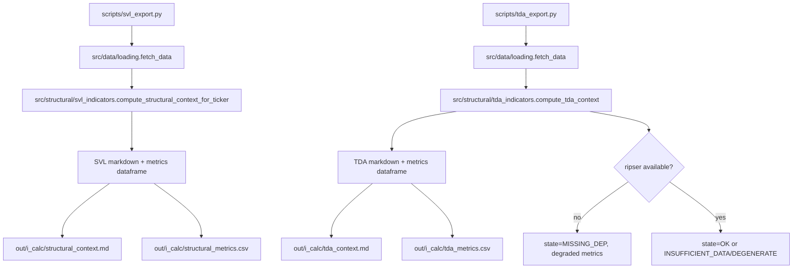
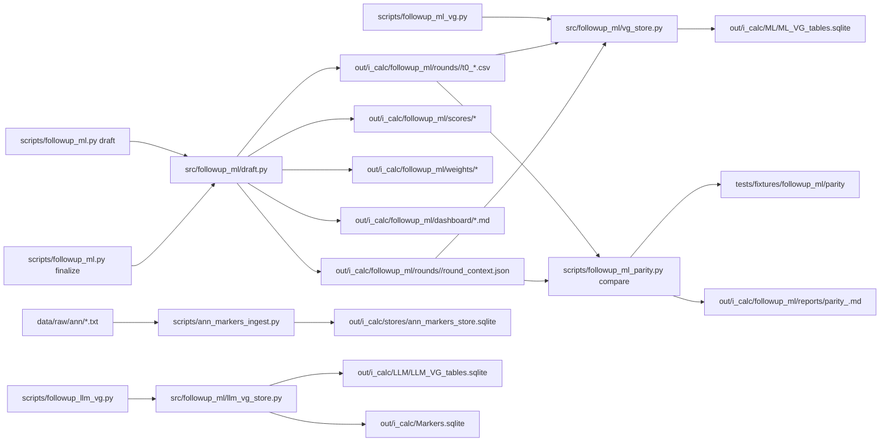
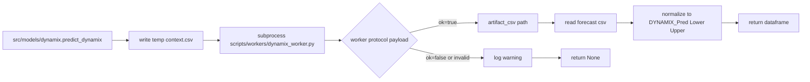

# End-to-End Pipeline Diagrams

## 1) Forecasting and GUI Runtime Pipeline

## 2) Structural Context Export Pipeline (SVL/TDA)

## 3) Follow-up ML and VG Materialization Pipeline

## 4) DynaMix Worker Integration Sub-Pipeline

