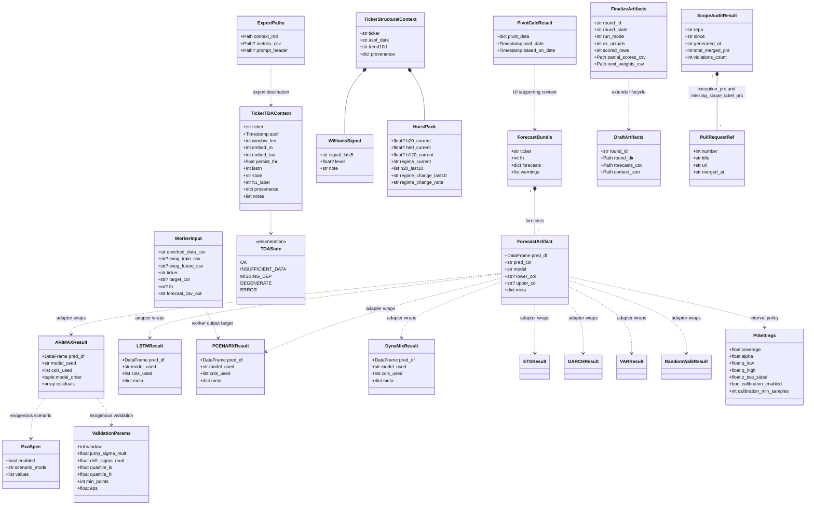

# UML Class Relationship Diagram

```mermaid
classDiagram
  class ForecastArtifact {
    +DataFrame pred_df
    +str pred_col
    +str model
    +str? lower_col
    +str? upper_col
    +dict meta
  }

  class ForecastBundle {
    +str ticker
    +int fh
    +dict forecasts
    +list warnings
  }

  class ARIMAXResult {
    +DataFrame pred_df
    +str model_used
    +list cols_used
    +tuple model_order
    +array residuals
  }

  class LSTMResult {
    +DataFrame pred_df
    +str model_used
    +list cols_used
    +dict meta
  }

  class PCENARXResult {
    +DataFrame pred_df
    +str model_used
    +list cols_used
    +dict meta
  }

  class DynaMixResult {
    +DataFrame pred_df
    +str model_used
    +list cols_used
    +dict meta
  }

  class ETSResult
  class GARCHResult
  class VARResult
  class RandomWalkResult

  class PISettings {
    +float coverage
    +float alpha
    +float q_low
    +float q_high
    +float z_two_sided
    +bool calibration_enabled
    +int calibration_min_samples
  }

  class ExoSpec {
    +bool enabled
    +str scenario_mode
    +list values
  }

  class ValidationParams {
    +int window
    +float jump_sigma_mult
    +float drift_sigma_mult
    +float quantile_lo
    +float quantile_hi
    +int min_points
    +float eps
  }

  class WilliamsSignal {
    +str signal_last5
    +float? level
    +str note
  }

  class HurstPack {
    +float? h20_current
    +float? h60_current
    +float? h120_current
    +str regime_current
    +list h20_last10
    +str regime_change_last10
    +str regime_change_note
  }

  class TickerStructuralContext {
    +str ticker
    +str asof_date
    +str trend10d
    +dict provenance
  }

  class TickerTDAContext {
    +str ticker
    +Timestamp asof
    +int window_len
    +int embed_m
    +int embed_tau
    +float persist_thr
    +int lastn
    +str state
    +str h1_label
    +dict provenance
    +list notes
  }

  class TDAState <<enumeration>> {
    OK
    INSUFFICIENT_DATA
    MISSING_DEP
    DEGENERATE
    ERROR
  }

  class PivotCalcResult {
    +dict pivot_data
    +Timestamp asof_date
    +Timestamp based_on_date
  }

  class DraftArtifacts {
    +str round_id
    +Path round_dir
    +Path forecasts_csv
    +Path context_json
  }

  class FinalizeArtifacts {
    +str round_id
    +str round_state
    +str run_mode
    +int ok_actuals
    +int scored_rows
    +Path partial_scores_csv
    +Path next_weights_csv
  }

  class PullRequestRef {
    +int number
    +str title
    +str url
    +str merged_at
  }

  class ScopeAuditResult {
    +str repo
    +str since
    +str generated_at
    +int total_merged_prs
    +int violations_count
  }

  class WorkerInput {
    +str enriched_data_csv
    +str? exog_train_csv
    +str? exog_future_csv
    +str ticker
    +str? target_col
    +int? fh
    +str forecast_csv_out
  }

  class ExportPaths {
    +Path context_md
    +Path? metrics_csv
    +Path? prompt_header
  }

  ForecastBundle "1" *-- "*" ForecastArtifact : forecasts
  ForecastArtifact ..> PISettings : interval policy

  ForecastArtifact ..> ARIMAXResult : adapter wraps
  ForecastArtifact ..> LSTMResult : adapter wraps
  ForecastArtifact ..> PCENARXResult : adapter wraps
  ForecastArtifact ..> DynaMixResult : adapter wraps
  ForecastArtifact ..> ETSResult : adapter wraps
  ForecastArtifact ..> GARCHResult : adapter wraps
  ForecastArtifact ..> VARResult : adapter wraps
  ForecastArtifact ..> RandomWalkResult : adapter wraps

  ARIMAXResult ..> ExoSpec : exogenous scenario
  ARIMAXResult ..> ValidationParams : exogenous validation

  TickerStructuralContext *-- HurstPack
  TickerStructuralContext *-- WilliamsSignal
  TickerTDAContext ..> TDAState

  FinalizeArtifacts ..> DraftArtifacts : extends lifecycle
  ScopeAuditResult "1" *-- "*" PullRequestRef : exception_prs and missing_scope_label_prs

  WorkerInput ..> PCENARXResult : worker output target
  ExportPaths ..> TickerTDAContext : export destination
  PivotCalcResult ..> ForecastBundle : UI supporting context
```
