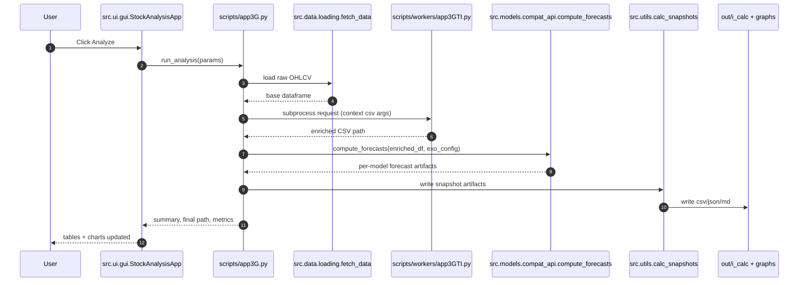
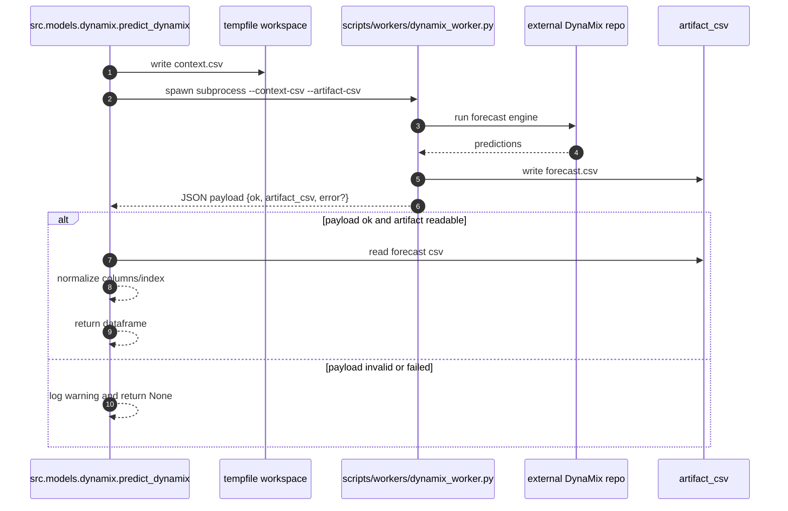
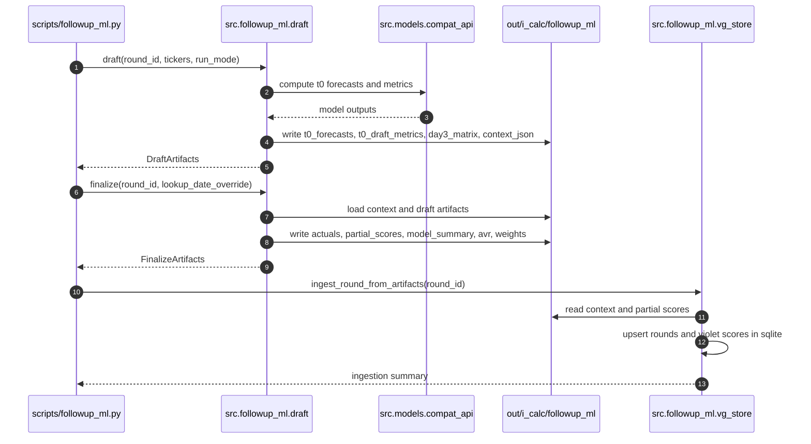
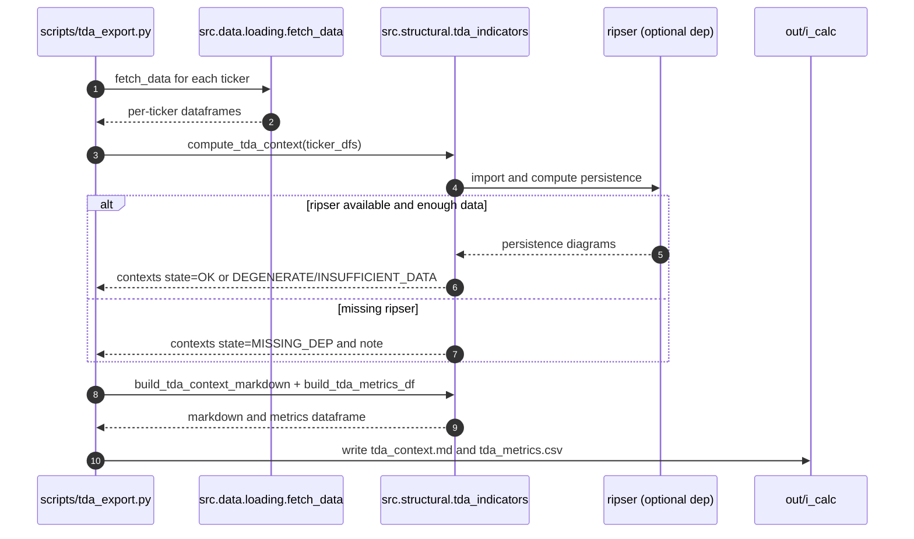

# UML Sequence Diagrams

## Sequence 1: GUI Analysis Run (`scripts/app3G.py`)

## Sequence 2: DynaMix Worker Protocol

## Sequence 3: Follow-up ML Draft and Finalize

## Sequence 4: TDA Export with Degradation Path

