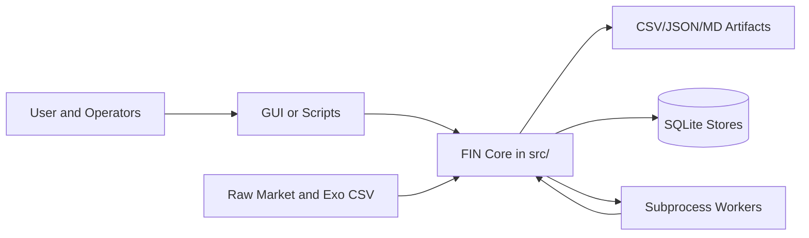

# Software Specification (SwS) - FIN

Version: 1.0 (documentation baseline)

## 1. Purpose and Scope

FIN is a forecasting and scenario engine for a fixed ticker set and related market indicators. It provides:
- Multi-model forward forecasts (ARIMAX, PCE-NARX, LSTM, DynaMix, ETS, GARCH, VAR, RW).
- Structural context exports (SVL and TDA).
- Follow-up scoring, weighting, parity checks, and VG materialization.
- Desktop GUI and script-based operational entrypoints.

In-scope implementation boundary:
- Canonical runtime in `src/`.
- Compatibility adapters in `compat/`.
- Operational CLI/worker paths in `scripts/`.

## 2. System Context

## 3. Architectural Overview

### 3.1 Layering

- Presentation and entrypoints: `app3G.py`, `scripts/*.py`, `src/ui/gui.py`.
- Canonical business logic: `src/models`, `src/structural`, `src/followup_ml`, `src/data`, `src/exo`, `src/utils`.
- Compatibility layer: `compat/*` delegates to canonical modules.
- Externalized heavy paths: workers in `scripts/workers/*`.

### 3.2 Architectural Constraints

- Canonical model logic belongs in `src/`, not `compat/`.
- Compatibility modules must remain thin delegation wrappers.
- Optional dependencies must be gated and degrade deterministically.
- Forecast outputs should normalize to facade contracts (`ForecastArtifact`).

## 4. Functional Specification

### FR-001 Data Loading

System shall load historical market data from canonical raw CSV locations and normalize date index/order.

Primary implementation:
- `src/data/loading.py`

### FR-002 Forecast Computation Orchestration

System shall compute per-ticker forecasts across enabled model paths and select a final path based on configured priority/fallback behavior.

Primary implementation:
- `src/models/facade.py`
- `src/models/compat_api.py`

### FR-003 Model Output Contract

System shall emit normalized forecast outputs with point forecast column and optional interval columns.

Primary implementation:
- `src/models/facade.ForecastArtifact`

### FR-004 Structural Context Export (SVL)

System shall compute and export Hurst/Trend/Williams structural context per ticker as markdown and csv.

Primary implementation:
- `src/structural/svl_indicators.py`
- `scripts/svl_export.py`

### FR-005 Topological Context Export (TDA)

System shall compute and export TDA context and metrics with explicit state signaling.

Primary implementation:
- `src/structural/tda_indicators.py`
- `scripts/tda_export.py`

### FR-006 Follow-up Draft and Finalize Lifecycle

System shall support draft and finalize phases that produce deterministic artifacts for scoring and weighting.

Primary implementation:
- `src/followup_ml/draft.py`
- `scripts/followup_ml.py`

### FR-007 VG Materialization

System shall ingest round outputs and materialize violet/blue/green scoring views in sqlite stores.

Primary implementation:
- `src/followup_ml/vg_store.py`
- `src/followup_ml/llm_vg_store.py`

### FR-008 Marker Ingestion

System shall ingest marker markdown tables into canonical sqlite storage with idempotent file-hash behavior.

Primary implementation:
- `scripts/ann_markers_ingest.py`

### FR-009 Worker Isolation for Heavy Dependencies

System shall execute selected forecast paths through subprocess workers and consume machine-readable contracts.

Primary implementation:
- `scripts/workers/dynamix_worker.py`
- `scripts/workers/pce_worker.py`
- worker adapters in `src/models/*` and `src/models/compat_api.py`

### FR-010 Parity Verification

System shall snapshot and compare follow-up artifacts against fixture baselines with tolerance controls.

Primary implementation:
- `scripts/followup_ml_parity.py`
- `scripts/followup_ml_ci_parity_gate.py`

### FR-011 Governance Scope Audit

System shall audit merged PRs for scope-label compliance and produce summary/report output.

Primary implementation:
- `src/followup_ml/scope_audit.py`
- `scripts/followup_ml_scope_audit.py`

### FR-012 Entrypoint Operability

System entrypoints shall start and provide help-mode behavior without import-time crashes.

Primary implementation:
- `app3G.py`
- `scripts/*.py`

## 5. Non-Functional Requirements

### NFR-001 Deterministic Degradation

Missing optional dependencies or insufficient data must result in deterministic fallback or explicit error state, not undefined behavior.

### NFR-002 Contract Stability

Public boundaries (facade artifacts, worker payloads, sqlite schema) must remain versioned and backward-compatible where possible.

### NFR-003 Import Safety and Thin Compat Layer

`compat/` shall avoid heavy model imports and oversized function bodies, preserving adapter-only behavior.

### NFR-004 Observability

Boundary failures should include context-rich logs (ticker/model/path/state).

### NFR-005 Operational Robustness

Scripts must run from repository root and remain robust to path/environment differences via bootstrap logic.

## 6. Interfaces

### 6.1 File Interfaces

- Inputs: `data/raw/tickers/*.csv`, `data/raw/exoregressors/Exo_regressors.csv`, `data/raw/ann/*.txt`.
- Outputs: artifact families under `out/i_calc/*` and chart artifacts under `graphs/`.

### 6.2 Worker Interfaces

- DynaMix worker emits JSON stdout payload with protocol fields (`protocol_version`, `ok`, `artifact_csv`, `meta`, `error`).
- PCE worker uses JSON file input and JSON file output with status enum (`OK`, `INSUFFICIENT_DATA`, `ERROR`).

### 6.3 Data Store Interfaces

- SQLite contracts documented in `docs/fin/data/sql_json_schema.md`.

## 7. Error Handling and Degradation

- Model-level errors generally return `None` to orchestration layer, allowing fallback selection.
- TDA exports encode degraded state in `TickerTDAContext.state` (`MISSING_DEP`, `INSUFFICIENT_DATA`, `DEGENERATE`, `ERROR`).
- Worker failures are surfaced through machine-readable protocol fields and logged by caller.

## 8. Security and Data Integrity

- No credential management is defined in FIN core.
- SQLite writes are local and path-based; schema constraints enforce key integrity.
- Worker boundaries should treat all file paths and payload fields as untrusted input.

## 9. Verification Strategy

- Unit tests for modules and contracts under `tests/`.
- Import and adapter policy guardrails:
  - `tests/test_compat_import_hygiene.py`
  - `tests/test_compat_thinness_shape.py`
  - `tests/test_facade_import_smoke.py`
- Entrypoint startup/help smoke:
  - `tests/test_entrypoints_smoke.py`

Detailed requirement mapping is in `docs/fin/spec/requirements_traceability.md`.

## 10. Operational Runbook Summary

- Forecast GUI path: `python app3G.py`.
- Structural exports: `python scripts/svl_export.py ...`, `python scripts/tda_export.py ...`.
- Follow-up cycle: `python scripts/followup_ml.py ...` then optional VG/parity tools.
- Scope audit: `python scripts/followup_ml_scope_audit.py --since YYYY-MM-DD`.

## 11. Risks and Open Items

- Mixed worker protocol maturity (stdout JSON vs file-based JSON vs legacy stdout CSV path) increases adapter complexity.
- Some contracts are artifact-driven and loosely typed in JSON; stronger schema enforcement is recommended.
- External DynaMix repository dependency introduces environment coupling and path-discovery complexity.
