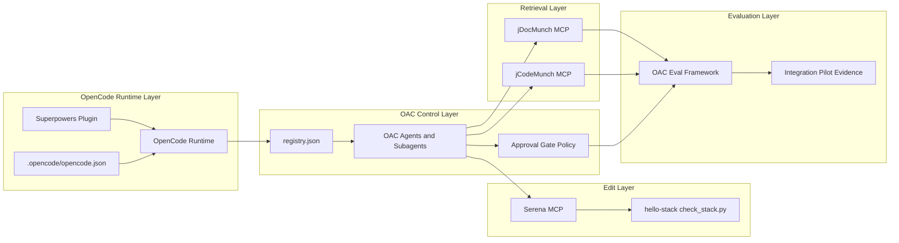

# OC Architecture

## Layer Model

The OC project is organized as five operational layers.

1. Runtime layer: OpenCode process, runtime config, and plugin activation.
2. Control layer: OAC registry components, agent graph, and approval authority.
3. Retrieval layer: jCodeMunch and jDocMunch retrieval services.
4. Edit layer: Serena semantic editing and stack-check execution utility.
5. Evaluation layer: OAC eval framework and pilot evidence artifacts.

## Architecture Diagram

## Object-to-Source Map

| Architecture Object | Source Path |
| --- | --- |
| Runtime config | `.opencode/opencode.json` |
| Superpowers plugin activation | `.opencode/opencode.json` |
| OAC registry root | `vendor/OpenAgentsControl/registry.json` |
| OAC agent definitions | `vendor/OpenAgentsControl/.opencode/agent/` |
| OAC context and skills | `vendor/OpenAgentsControl/.opencode/context/`, `vendor/OpenAgentsControl/.opencode/skill/` |
| Retrieval MCP examples | `tools/hello-stack/opencode.mcp.example.json` |
| Edit stack checker | `tools/hello-stack/check_stack.py` |
| Eval framework classes | `vendor/OpenAgentsControl/evals/framework/src/` |
| Pilot authority decisions | `docs/integration-pilot/adr/0003-control-plane-authority-hierarchy.md` |

## Current Inventory Snapshot

- In-scope files: 440 (`docs/oc/generated/oc_inventory.json`)
- OAC registry component counts: agents 8, subagents 18, commands 16, tools 2, plugins 1, skills 4, contexts 177
- Dependency edges in registry graph: 45
