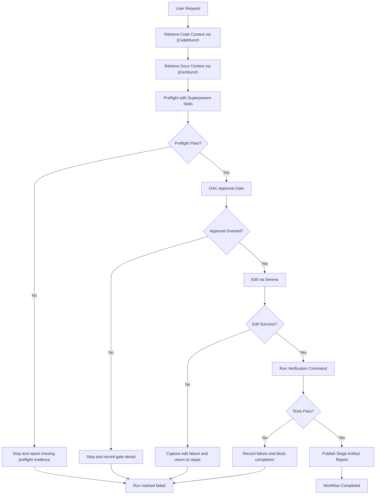

# End-to-End Pipeline

## Stage Contract

The OC workflow follows a five-stage evidence model.

1. Retrieval
2. Planning and preflight
3. Approval
4. Edit
5. Test and result

Evidence contract source: `docs/integration-pilot/epic-4-workflow-artifact-spec.md`

## Pipeline Diagram

## Failure Boundary Rules

- Missing retrieval evidence blocks transition into planning.
- Preflight failure blocks gate request.
- Approval denial blocks all edit actions.
- Edit failure blocks test stage.
- Test failure blocks completion artifact.

Control authority source: `docs/integration-pilot/adr/0003-control-plane-authority-hierarchy.md`
