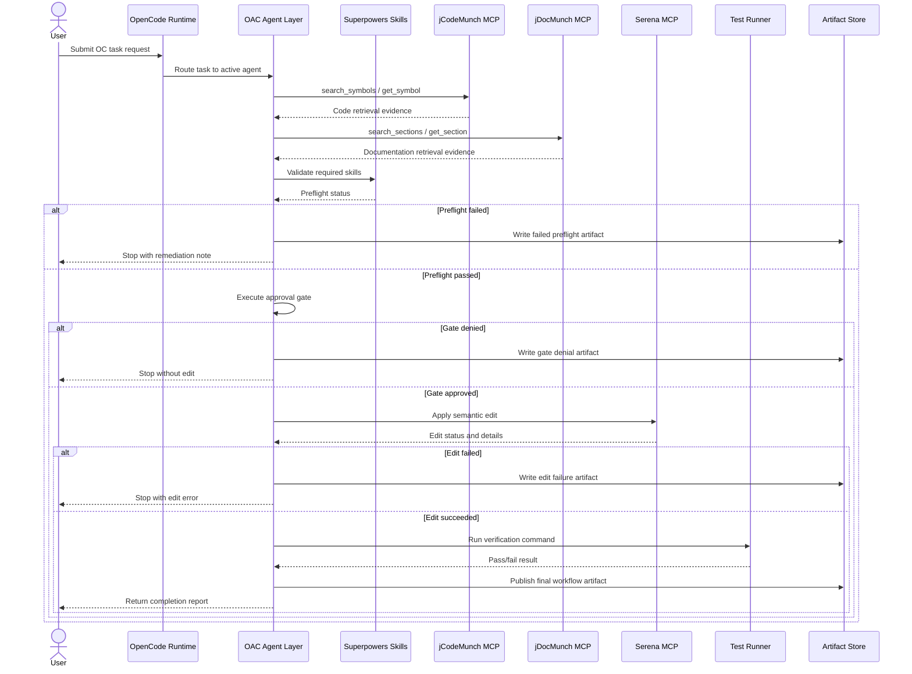

# UML Sequence Diagram

## Diagram

## Notes

- Retrieval evidence is mandatory before planning.
- Approval is final authority before edits.
- Artifact publication is required for each stage transition.
